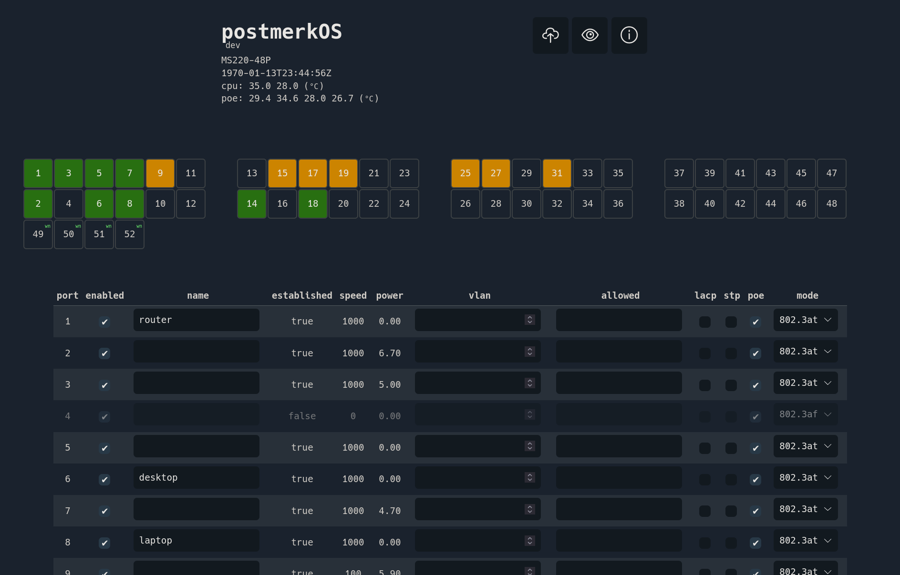

# postmerkOS UI

A basic web interface for [meraki-builder](https://github.com/halmartin/meraki-builder) firmware.

## Installation

> **NOTE**: the [`configd`](https://github.com/halmartin/meraki-builder/pull/18)
daemon must currently be manually started (and, given the alpha nature of this
program, it's not recommended to automate it at boot)

Download the latest release

    wget https://github.com/hall/postmerkos-ui/releases/latest/download/postmerkos-ui.zip 

Move it onto your switch

    scp -O postmerkos-ui.zip <switch>:

Unzip and update the permissions

    unzip postmerkos-ui.zip

    chmod o+r -R ./postmerkos-ui
    chmod o+x -R ./postmerkos-ui/cgi-bin

Start `uhttpd` on port 80

    uhttpd -p 80 -h ./postmerkos-ui

Open http://<switch> in your browser and use your PAM login credentials.

## Development

Install dependencies with

    npm i

For live-reloading (without auth or persistent config):

    npm run dev

Navigate to http://localhost:8080

Or, using docker,

    docker run -it -v $PWD:/app -w /app --entrypoint sh node:14-alpine -c "npm i && npm run dev"

## Releasing

A GitHub action (defined in [`.github/workflows/main.yaml`](./.github/workflows/main.yaml)) will run whenever a new tag is pushed and create a release.

## Contributing

Pull requests are welcome. For major changes, please open an issue first to discuss what you would like to change.

## Credits

- Icons by https://github.com/danklammer/bytesize-icons
